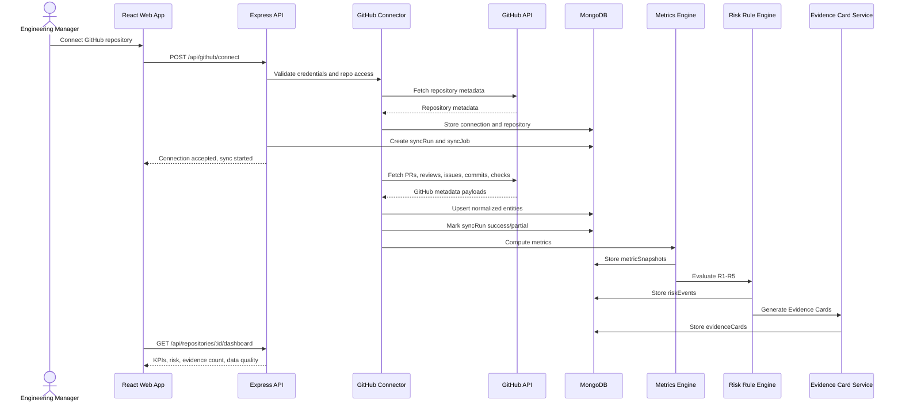
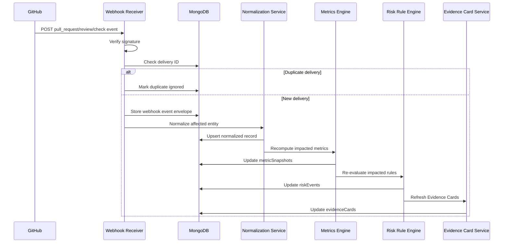
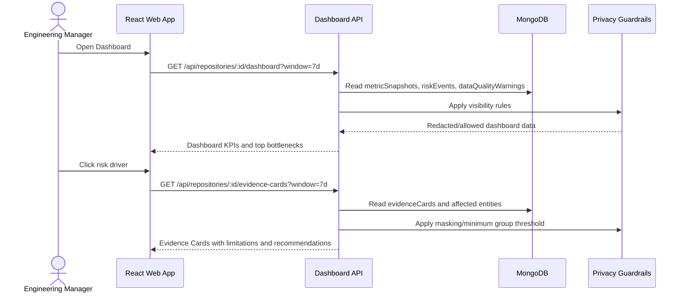
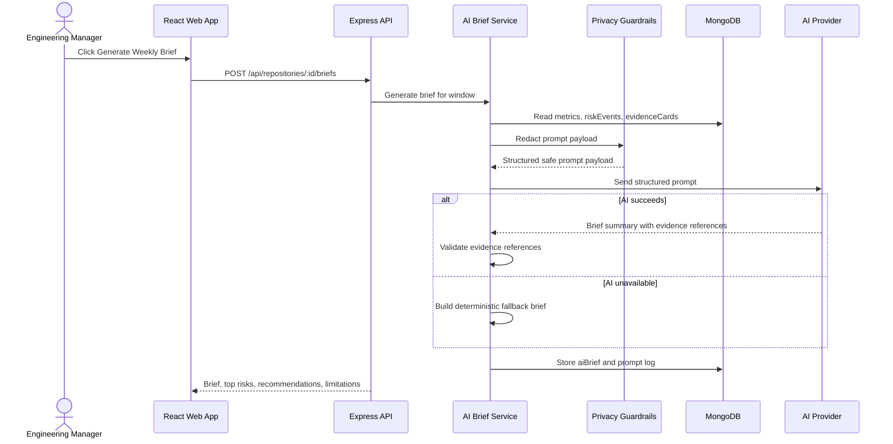

# GitHub-only MVP Use Cases, Flows, Backlog, and Sprint Plan

## 1. Scope Boundary

MVP focuses only on GitHub repository workflow analytics.

Included:

- GitHub repository connection or token-based prototype connection.
- Initial GitHub API backfill for pull requests, reviews, issues metadata, commits metadata, and check runs.
- Webhook ingestion or polling / Sync now fallback.
- Normalization into MongoDB.
- Metrics engine for GitHub flow KPIs.
- Risk rule engine using R1-R5 Flow Risk Rulebook.
- Evidence Cards linked to GitHub records.
- AI Weekly Brief generated from structured metrics and Evidence Cards.
- Privacy guardrails: no individual productivity score, no HR or medical inference.

Excluded:

- Jira integration.
- Sprint commitment, story points, Jira status transition, carryover, backlog, or velocity analytics.
- Raw source code analysis.
- Individual productivity ranking.
- Burnout diagnosis.
- Enterprise RBAC, SOC 2, SAML SSO, billing, or organization-wide analytics.

## 2. MVP Use Case List

| ID | Use Case | Primary Actor | Priority | Difficulty | Suggested Owner | Main Modules |
|---|---|---|---|---|---|---|
| UC-01 | Connect GitHub repository | Engineering Manager | Must | Hard | Strong Dev 1 | GitHub Connector, Dashboard API |
| UC-02 | Disconnect repository and clear synced data | Engineering Manager | Should | Medium | Strong Dev 1 | GitHub Connector, Repository API |
| UC-03 | Run initial GitHub backfill | Engineering Manager / System | Must | Hard | Strong Dev 1 | GitHub Connector, Sync Orchestrator, Normalization |
| UC-04 | Normalize GitHub entities into MongoDB | System | Must | Hard | Strong Dev 2 | Normalization, MongoDB Models |
| UC-05 | View sync status | Engineering Manager | Must | Easy | Junior Dev 1 | Sync Jobs, Dashboard API, UI |
| UC-06 | View data quality warnings | Engineering Manager | Must | Medium | Junior Dev 1 | Data Quality, Dashboard API, UI |
| UC-07 | Run manual Sync now fallback | Engineering Manager | Should | Medium | Strong Dev 1 | Sync Orchestrator, GitHub Connector |
| UC-08 | Receive GitHub webhook update | GitHub / System | Should | Hard | Strong Dev 2 | Webhook Receiver, Normalization |
| UC-09 | Calculate PR flow metrics | System | Must | Hard | Strong Dev 3 | Metrics Engine |
| UC-10 | Calculate review and CI metrics | System | Must | Hard | Strong Dev 3 | Metrics Engine |
| UC-11 | View Team Flow Dashboard | Engineering Manager | Must | Medium | Junior Dev 2 | Dashboard API, Metrics Engine, UI |
| UC-12 | View bottleneck summary | Engineering Manager | Must | Medium | Junior Dev 2 | Dashboard API, Risk Summary, UI |
| UC-13 | Evaluate Delivery Flow Risk rules | System | Must | Hard | Strong Dev 3 | Risk Rule Engine |
| UC-14 | View Flow Risk Rulebook | Engineering Manager | Must | Easy | Junior Dev 2 | Rulebook API, UI |
| UC-15 | Generate Evidence Cards | System | Must | Hard | Strong Dev 2 | Evidence Card Service |
| UC-16 | View Evidence Card details | Engineering Manager | Must | Medium | Junior Dev 2 | Evidence API, UI |
| UC-17 | Generate AI Weekly Brief | Engineering Manager | Must | Hard | Strong Dev 3 | AI Brief Service, Privacy Guardrails |
| UC-18 | Use deterministic brief fallback when AI fails | System | Must | Medium | Strong Dev 3 | AI Brief Service |
| UC-19 | Manage privacy settings and prohibited-use notice | Engineering Manager | Should | Easy | Junior Dev 1 | Privacy Guardrails, UI |
| UC-20 | Import sample GitHub-style data for demo fallback | Engineering Manager | Should | Medium | Junior Dev 1 | Sample Import, Normalization |

## 2.1 Suggested 5-Member Responsibility Split

| Team Member | Skill Level | Main Ownership | Use Cases |
|---|---|---|---|
| Strong Dev 1 | High | GitHub connection, backfill, manual sync | UC-01, UC-02, UC-03, UC-07 |
| Strong Dev 2 | High | Normalization, webhook, Evidence Cards | UC-04, UC-08, UC-15 |
| Strong Dev 3 | High | Metrics, risk rules, AI brief | UC-09, UC-10, UC-13, UC-17, UC-18 |
| Junior Dev 1 | Lower | Sync/data quality UI, privacy UI, sample import support | UC-05, UC-06, UC-19, UC-20 |
| Junior Dev 2 | Lower | Dashboard, bottleneck, rulebook, evidence UI | UC-11, UC-12, UC-14, UC-16 |

Difficulty guide:

- Easy: mostly UI, display, simple API integration, or static policy content.
- Medium: requires API + UI coordination, validation, or moderate backend logic.
- Hard: requires external integration, data normalization, analytics calculation, rule evaluation, webhook processing, or AI output validation.

## 3. Use Case Descriptions

### UC-01: Connect GitHub Repository

**Goal:** Engineering Manager connects one GitHub repository so the system can analyze GitHub workflow metadata.

**Preconditions:**

- User is logged in to the app.
- User has permission to connect or provide read-only access to a GitHub repository.

**Main Flow:**

1. User opens Connect page.
2. User selects GitHub connection method: GitHub App, OAuth, or prototype token.
3. Backend validates credentials and requested permissions.
4. Backend creates `githubConnections` and `repositories` records.
5. Backend creates default `privacySettings`.
6. System queues initial backfill job.
7. UI shows sync status.

**Alternates / Edge Cases:**

- Missing permission: show warning and mark sync coverage as partial.
- Invalid token: reject connection and show clear error.
- Repository already connected: reuse or ask user to reconnect.

**Postconditions:**

- Repository exists in MongoDB.
- Initial backfill job is queued.
- User can view sync progress.

### UC-02: Disconnect Repository and Clear Synced Data

**Goal:** Engineering Manager disconnects a repository and removes synced metadata when the repository is no longer used for analytics.

**Main Flow:**

1. User opens repository settings.
2. User chooses disconnect repository.
3. System asks for confirmation.
4. Backend revokes or marks connection inactive.
5. Backend deletes or archives synced analytics data based on MVP policy.
6. UI confirms the repository is disconnected.

**Postconditions:**

- Repository no longer appears in active dashboard.
- GitHub token/connection is no longer usable.

### UC-03: Run Initial GitHub Backfill

**Goal:** System imports historical GitHub metadata for the selected repository.

**Preconditions:**

- Repository is connected.
- Valid GitHub access is available.

**Main Flow:**

1. Sync Orchestrator starts a `syncRuns` record.
2. GitHub Connector fetches repository metadata.
3. Connector fetches pull requests in the configured 30-90 day window.
4. Connector fetches reviews, review requests, issues metadata, commits metadata, and check runs where available.
5. Normalization Service upserts records into MongoDB using source IDs.
6. Metrics Engine calculates KPI snapshots.
7. Risk Rule Engine evaluates R1-R5.
8. Evidence Card Service creates cards for triggered rules.
9. Sync run is marked success, partial, or failed.

**Alternates / Edge Cases:**

- GitHub rate limit reached: mark partial sync and resume later.
- Checks permission missing: create data quality warning; R4 returns insufficient data.
- Duplicate records: source IDs prevent duplication.

**Postconditions:**

- Normalized GitHub data is stored.
- Metrics, risk events, and Evidence Cards are available.

### UC-04: Normalize GitHub Entities into MongoDB

**Goal:** System converts GitHub API/webhook payloads into stable internal MongoDB entities.

**Main Flow:**

1. System receives GitHub payloads from backfill, polling, webhook, or sample import.
2. Normalization maps source IDs to internal records.
3. Contributors, PRs, reviews, review requests, issues, commits, and checks are upserted.
4. Raw code and raw comment bodies are excluded by default.
5. Duplicate entities are ignored or updated idempotently.

**Postconditions:**

- MongoDB contains clean, queryable GitHub metadata.
- Analytics can use stable internal references.

### UC-05: View Sync Status

**Goal:** User understands whether dashboard and AI output can be trusted.

**Main Flow:**

1. User opens Connect or Dashboard page.
2. UI requests `/api/repositories/:id/sync-status`.
3. Backend returns latest sync status, last sync time, records processed, and current job state.
4. UI displays pending, running, success, partial, or failed.

### UC-06: View Data Quality Warnings

**Goal:** User sees limitations that affect metric and AI reliability.

**Main Flow:**

1. User opens Dashboard or Connect page.
2. UI requests `/api/repositories/:id/data-quality`.
3. Backend returns warnings and missing coverage.
4. UI displays Good, Partial, or Poor data quality.

**Key Warnings:**

- Missing checks permission.
- Failed or partial backfill.
- Duplicate webhook ignored.
- No review data found.
- Invalid timestamps in sample/imported data.

### UC-07: Run Manual Sync Now Fallback

**Goal:** User manually refreshes GitHub data when webhook is unavailable or delayed.

**Main Flow:**

1. User clicks Sync now.
2. Backend creates a polling sync job.
3. GitHub Connector fetches records updated since the last sync.
4. Normalization upserts changed entities.
5. Metrics, risks, and Evidence Cards refresh.
6. UI shows updated sync status.

### UC-08: Receive GitHub Webhook Update

**Goal:** System updates analytics after GitHub sends a repository event.

**Main Flow:**

1. GitHub sends webhook to `/api/webhooks/github`.
2. Webhook Receiver verifies signature.
3. System deduplicates by delivery ID.
4. Event envelope is stored.
5. Affected entity is normalized.
6. Metrics and risk rules are recomputed for impacted window.
7. Evidence Cards are updated.

**Fallback:**

- If webhook endpoint is not feasible, use UC-07 manual Sync now.

### UC-09: Calculate PR Flow Metrics

**Goal:** System computes repeatable GitHub flow KPIs for dashboard, risk rules, and AI brief.

**Metrics:**

- Open PR count.
- PR cycle time.
- Merge time.
- Stale PR count.
- Oversized PR count.

**Postconditions:**

- `metricSnapshots` are stored for the selected analysis window.
- Missing data creates limitations instead of fabricated values.

### UC-10: Calculate Review and CI Metrics

**Goal:** System computes review and CI metrics that identify collaboration and pipeline bottlenecks.

**Metrics:**

- Review pickup time.
- Review turnaround time.
- Review load concentration.
- Failed check rate.

**Postconditions:**

- Review and CI metric snapshots are stored.
- Missing review/check data creates data quality warnings or insufficient-data states.

### UC-11: View Team Flow Dashboard

**Goal:** Engineering Manager sees repository health and bottlenecks in under 5 minutes.

**Main Flow:**

1. User opens Dashboard.
2. Backend returns repository overview, KPI cards, Delivery Flow Risk, top bottlenecks, and data quality.
3. UI displays KPIs with text labels and evidence links.
4. User clicks a bottleneck to open Risk and Evidence.

**Postconditions:**

- User can identify the top GitHub workflow bottleneck.

### UC-12: View Bottleneck Summary

**Goal:** Engineering Manager sees the top GitHub workflow bottlenecks without reading raw GitHub screens.

**Main Flow:**

1. User opens Dashboard.
2. Backend ranks bottlenecks by active risk severity and affected entity count.
3. UI shows bottleneck cards for stale PRs, review delay, reviewer concentration, CI friction, and oversized PRs.
4. User clicks a bottleneck to drill into Risk and Evidence.

### UC-13: Evaluate Delivery Flow Risk

**Goal:** System estimates GitHub delivery flow risk using explainable rules.

**MVP Rules:**

- R1: Stale PR Risk.
- R2: Review Pickup Risk.
- R3: Reviewer Concentration Risk.
- R4: CI Friction Risk.
- R5: Oversized PR Risk.

**Postconditions:**

- `riskEvents` are created with rule code, severity, metric value, threshold, affected entities, and limitations.

### UC-14: View Flow Risk Rulebook

**Goal:** User can inspect the exact rules used to calculate Delivery Flow Risk.

**Main Flow:**

1. User opens Risk and Evidence page.
2. User opens Flow Risk Rulebook.
3. UI displays rule ID, trigger condition, threshold, severity logic, evidence type, and recommended action category.

**Postconditions:**

- Capstone evaluator can verify the risk engine without reading source code.

### UC-15: Generate Evidence Cards

**Goal:** System creates evidence-backed cards for triggered risks.

**Main Flow:**

1. Risk Rule Engine creates a risk event.
2. Evidence Card Service selects affected GitHub entities.
3. Service attaches safe recommendation from the recommendation catalog.
4. Service stores title, summary, severity, evidence, confidence, and limitation.
5. Cards without evidence are suppressed.

**Postconditions:**

- Risk and AI surfaces can reuse the same Evidence Cards.

### UC-16: View Evidence Card Details

**Goal:** Engineering Manager verifies why a risk was triggered.

**Main Flow:**

1. User opens Risk and Evidence page.
2. UI requests risk events, rulebook, and Evidence Cards.
3. Backend returns risk drivers, evidence links, rule thresholds, confidence, limitations, and suggested actions.
4. User opens an Evidence Card and sees source PR/review/check references.

**Postconditions:**

- Every displayed insight has at least one evidence link or source metric.

### UC-17: Generate AI Weekly Brief

**Goal:** Engineering Manager generates a weekly management summary grounded in evidence.

**Main Flow:**

1. User opens AI Weekly Brief page.
2. User clicks Generate Brief.
3. Backend reads metric snapshots, risk events, Evidence Cards, and privacy settings.
4. Privacy Guardrails redact contributor names where enabled.
5. AI Brief Service builds structured prompt payload.
6. AI provider returns summary, top risks, recommendations, confidence, and limitations.
7. Backend validates evidence references.
8. Backend stores `aiBriefs` and optional `aiPromptLogs`.
9. UI displays the brief with evidence links.

**Fallback:**

- If AI API fails, use UC-18 deterministic fallback.

### UC-18: Use Deterministic Brief Fallback When AI Fails

**Goal:** System still produces a useful weekly brief when AI provider is unavailable.

**Main Flow:**

1. AI call fails, times out, or is disabled.
2. Backend selects top Evidence Cards by severity.
3. Backend builds a deterministic brief with summary, top risks, recommendations, and limitations.
4. UI labels the brief as fallback-generated.

**Postconditions:**

- Demo path remains reliable even without AI API.

### UC-19: Manage Privacy Settings and Prohibited-Use Notice

**Goal:** User controls privacy-safe analytics behavior.

**Main Flow:**

1. User opens Privacy page.
2. UI displays collected data, AI prompt policy, and prohibited-use notice.
3. User toggles contributor pseudonymization or views minimum group threshold.
4. Backend updates `privacySettings`.

**Guardrails:**

- No individual productivity ranking.
- No burnout diagnosis.
- No HR recommendation.
- No raw source code or raw comment bodies sent to AI by default.

### UC-20: Import Sample GitHub-style Data

**Goal:** Capstone demo can proceed without live GitHub credentials.

**Main Flow:**

1. User uploads JSON/CSV sample dataset.
2. System validates schema and dates.
3. Normalization stores GitHub-style entities.
4. Metrics, risks, and Evidence Cards are generated.
5. UI labels data source as sample/imported.

## 4. Main User Flows

### Flow A: Connect Repository to Dashboard

1. User logs in.
2. User opens Connect.
3. User connects GitHub repository.
4. System starts initial backfill.
5. User watches sync status.
6. System normalizes data.
7. System calculates metrics and risk.
8. User opens Dashboard.
9. User sees KPIs, Delivery Flow Risk, top bottleneck, and data quality.

### Flow B: Investigate Risk Through Evidence

1. User sees High or Medium Delivery Flow Risk on Dashboard.
2. User clicks risk badge or bottleneck card.
3. System opens Risk and Evidence page.
4. User reviews triggered rule, threshold, metric value, affected PRs/checks/reviews.
5. User opens Evidence Card.
6. User chooses safe workflow action, such as assign backup reviewer or inspect failed check.

### Flow C: Generate Weekly Brief

1. User opens AI Weekly Brief page.
2. System checks if metrics and Evidence Cards exist.
3. User clicks Generate.
4. System applies privacy redaction.
5. System calls AI provider or deterministic fallback.
6. System validates evidence references.
7. User reads summary, top risks, recommendations, confidence, and limitations.

### Flow D: Update Data After New GitHub Activity

1. New PR/review/check event occurs in GitHub.
2. GitHub sends webhook or user clicks Sync now.
3. System deduplicates and normalizes changed entity.
4. Metrics Engine recomputes affected snapshots.
5. Risk Rule Engine refreshes risk events.
6. Evidence Cards update.
7. Dashboard and Risk pages show fresh data.

## 5. Sequence Diagrams

### 5.1 Repository Connection and Initial Backfill

### 5.2 Webhook Update Flow

### 5.3 Dashboard, Risk, and Evidence Flow

### 5.4 AI Weekly Brief Flow

## 6. Implementation Backlog

### Epic E1: Project Foundation and MongoDB Data Model

| Story | Title | Priority | Acceptance Criteria |
|---|---|---|---|
| E1-S1 | Scaffold React + Express + TypeScript modular monolith | Must | Frontend and backend run locally; shared env config exists; basic health endpoint works. |
| E1-S2 | Define MongoDB/Mongoose schemas | Must | Schemas exist for repositories, connections, contributors, PRs, reviews, issues, commits, checkRuns, syncRuns, metricSnapshots, riskEvents, evidenceCards, aiBriefs, privacySettings. |
| E1-S3 | Add repository and sync job indexes | Must | Unique indexes prevent duplicate GitHub entities; query indexes support dashboard/risk queries. |
| E1-S4 | Add basic local user/session prototype | Should | User can access Connect/Dashboard pages with a prototype session. |

### Epic E2: GitHub Sync and Normalization

| Story | Title | Priority | Acceptance Criteria |
|---|---|---|---|
| E2-S1 | Implement GitHub connection endpoint | Must | `POST /api/github/connect` stores one repository connection and validates credentials or mock token. |
| E2-S2 | Implement initial PR backfill | Must | System fetches PR metadata within backfill window and stores normalized PRs. |
| E2-S3 | Implement reviews and review requests sync | Must | Reviews and requested reviewers are normalized and linked to PRs. |
| E2-S4 | Implement issues, commits metadata, and checks sync | Must | Metadata is stored without raw code or raw body ingestion by default. |
| E2-S5 | Implement sync status and data quality warnings | Must | UI/API exposes success, partial, failed, missing permissions, last synced time, and records processed. |
| E2-S6 | Implement sample GitHub-style import fallback | Should | JSON/CSV sample data can populate normalized collections for demo. |

### Epic E3: Metrics Engine

| Story | Title | Priority | Acceptance Criteria |
|---|---|---|---|
| E3-S1 | Calculate PR and merge metrics | Must | PR cycle time, merge time, open PR count, stale PR count are stored as `metricSnapshots`. |
| E3-S2 | Calculate review metrics | Must | Review pickup time, review turnaround time, and review load concentration are computed. |
| E3-S3 | Calculate CI and PR size metrics | Must | Failed check rate and oversized PR count are computed or marked insufficient data. |
| E3-S4 | Add baseline/window support | Should | Metrics support current 7d window and optional previous-window comparison. |
| E3-S5 | Add metrics unit tests | Must | Each metric has normal, missing-data, and edge-case tests. |

### Epic E4: Risk Rule Engine and Evidence Cards

| Story | Title | Priority | Acceptance Criteria |
|---|---|---|---|
| E4-S1 | Implement Flow Risk Rulebook R1-R5 | Must | Each rule has rule code, threshold, severity, affected entities, and insufficient-data behavior. |
| E4-S2 | Store risk events | Must | Triggered rules create `riskEvents` with metric value, threshold, severity, and affected entity refs. |
| E4-S3 | Implement recommendation catalog | Must | Each rule maps to safe workflow recommendations without HR/performance language. |
| E4-S4 | Generate Evidence Cards | Must | Each triggered risk creates at least one Evidence Card with evidence, confidence, limitation, and suggested action. |
| E4-S5 | Suppress unsupported insights | Must | Cards without evidence are not shown and cannot feed AI brief. |
| E4-S6 | Add rule accuracy tests | Must | Each R1-R5 has one fixture that triggers it and one fixture that does not. |

### Epic E5: Dashboard and Risk UI

| Story | Title | Priority | Acceptance Criteria |
|---|---|---|---|
| E5-S1 | Build Connect / Sync Status page | Must | User can connect/import, start sync, and see sync/data quality status. |
| E5-S2 | Build Team Flow Dashboard | Must | Dashboard shows repository overview, KPI cards, Delivery Flow Risk, top bottlenecks, and last sync time. |
| E5-S3 | Build Risk and Evidence page | Must | User can view risk drivers, rule thresholds, Evidence Cards, and affected GitHub records. |
| E5-S4 | Build Flow Risk Rulebook UI | Must | Rule IDs, trigger conditions, severity, evidence type, and action category are visible. |
| E5-S5 | Add empty/loading/error states | Must | UI handles no data, partial sync, poor data quality, and API errors. |

### Epic E6: AI Weekly Brief and Privacy Guardrails

| Story | Title | Priority | Acceptance Criteria |
|---|---|---|---|
| E6-S1 | Build structured prompt payload generator | Must | Prompt contains only metrics, Evidence Cards, limitations, and prohibited claims. |
| E6-S2 | Implement privacy redaction | Must | Contributor names can be pseudonymized; raw code/comment bodies are excluded by default. |
| E6-S3 | Implement AI brief generation endpoint | Must | `POST /api/repositories/:id/briefs` returns top risks, summary, recommendations, confidence, limitations. |
| E6-S4 | Add deterministic fallback brief | Must | If AI API fails, system generates a brief from top Evidence Cards. |
| E6-S5 | Build AI Weekly Brief UI | Must | User can generate, view, and inspect evidence-linked brief items. |
| E6-S6 | Build Privacy page / notice | Should | User sees data collected, AI prompt policy, no-HR-use notice, and masking status. |

### Epic E7: Webhook/Polling and Demo Hardening

| Story | Title | Priority | Acceptance Criteria |
|---|---|---|---|
| E7-S1 | Implement GitHub webhook receiver | Should | Endpoint verifies signature, stores event envelope, deduplicates delivery ID, and dispatches normalization. |
| E7-S2 | Implement polling / Sync now fallback | Must | User can refresh changed GitHub records without webhook. |
| E7-S3 | Recompute impacted analytics after updates | Must | New PR/review/check updates refresh metrics, risks, and Evidence Cards. |
| E7-S4 | Add capstone demo fixtures | Must | Seed data demonstrates stale PR, review delay, reviewer concentration, CI friction, and oversized PR. |
| E7-S5 | Add capstone evaluation tests | Must | Tests cover sync, metrics, rules, evidence coverage, privacy guardrails, and AI fallback. |

## 6.1 Backlog Ownership Guide for 5 Members

| Member | Recommended Stories | Difficulty Mix | Notes |
|---|---|---|---|
| Strong Dev 1 | E2-S1, E2-S2, E2-S5, E7-S2 | Hard + Medium | Own GitHub connection, backfill, sync status API, and manual Sync now. |
| Strong Dev 2 | E1-S2, E1-S3, E2-S3, E2-S4, E4-S4, E7-S1 | Hard + Medium | Own MongoDB model quality, normalization, webhook, and Evidence Card generation. |
| Strong Dev 3 | E3-S1, E3-S2, E3-S3, E4-S1, E4-S2, E6-S1, E6-S3, E6-S4 | Hard | Own metrics engine, risk rules, and AI brief logic. |
| Junior Dev 1 | E1-S4, E2-S6, E5-S1, E6-S2, E6-S6 | Easy + Medium | Own sample import UI/support, sync/data-quality display, privacy notice, and redaction UI checks with support from Strong Dev 2/3. |
| Junior Dev 2 | E5-S2, E5-S3, E5-S4, E5-S5, E6-S5 | Easy + Medium | Own dashboard/risk/brief screens using APIs created by stronger backend owners. |

Workload balancing rule:

- Strong members should own backend logic that can break correctness: GitHub sync, normalization, metrics, risk rules, AI validation.
- Lower-skill members should own UI surfaces, status displays, static rulebook/privacy content, and sample/demo workflows.
- Pair junior members with strong owners for integration points, especially sample import normalization and AI privacy redaction.

## 7. Sprint Breakdown for Coding

Assumption: five coding sprints, each 1-2 weeks depending on team capacity. Jira is excluded.

### Sprint 1: Foundation and Data Model

**Goal:** App skeleton and database foundation are ready.

**Build:**

- React + Vite + TypeScript frontend.
- Node.js + Express + TypeScript backend.
- MongoDB connection and Mongoose schemas.
- Core indexes and seed script.
- Basic navigation: Connect, Dashboard, Risk, Brief, Privacy.

**Done when:**

- Local app starts.
- Health endpoint works.
- Schemas and indexes are created.
- Seeded repository data can be inserted.

### Sprint 2: GitHub Sync Foundation

**Goal:** Repository connection and initial GitHub metadata sync work.

**Build:**

- GitHub connection/token prototype.
- Initial backfill for PRs.
- Reviews/review requests sync.
- Checks, commits metadata, issues metadata sync.
- Sync status and data quality warnings.
- Sample import fallback.

**Done when:**

- One repository can be connected or imported.
- Sync run stores normalized entities.
- Data quality status is visible.

### Sprint 3: Metrics Engine and Dashboard

**Goal:** Manager can see GitHub flow health.

**Build:**

- PR cycle time, merge time, stale PR count.
- Review pickup and turnaround metrics.
- Failed check rate and oversized PR metrics.
- Review load concentration.
- Metric snapshots.
- Dashboard KPI cards and bottleneck summary.

**Done when:**

- Dashboard loads in under 3 seconds for seeded demo data.
- Metrics have unit tests.
- Missing data shows limitations.

### Sprint 4: Risk Rules and Evidence Cards

**Goal:** Risks are explainable and traceable.

**Build:**

- R1 Stale PR Risk.
- R2 Review Pickup Risk.
- R3 Reviewer Concentration Risk.
- R4 CI Friction Risk.
- R5 Oversized PR Risk.
- Risk events.
- Recommendation catalog.
- Evidence Card generation and Risk/Evidence UI.
- Rulebook UI.

**Done when:**

- Each R1-R5 rule has trigger and non-trigger tests.
- Every displayed risk has at least one evidence link.
- User can drill from dashboard bottleneck to Evidence Card.

### Sprint 5: AI Weekly Brief, Privacy, and Demo Hardening

**Goal:** Capstone-ready workflow from sync to evidence-backed brief.

**Build:**

- Structured prompt payload.
- Privacy redaction and prohibited-claim instructions.
- AI provider call and deterministic fallback.
- AI Weekly Brief UI.
- Privacy notice page.
- Sync now fallback.
- Optional webhook receiver.
- Demo fixtures and evaluation tests.

**Done when:**

- User can generate an evidence-backed weekly brief.
- AI failure still returns deterministic brief.
- No UI shows individual productivity ranking.
- Demo path works end to end: connect/import -> dashboard -> risk evidence -> AI brief -> privacy notice.

## 8. Recommended Build Order

1. MongoDB schemas and seed data.
2. Sample import fallback.
3. GitHub connection and PR backfill.
4. Reviews/checks/issues/commits metadata sync.
5. Sync status and data quality.
6. Metrics engine.
7. Dashboard.
8. Risk Rulebook R1-R5.
9. Evidence Cards and recommendations.
10. AI Weekly Brief with deterministic fallback.
11. Privacy guardrails.
12. Webhook or Sync now update path.
13. Capstone demo fixtures and tests.

## 9. Traceability to Architecture Modules

| Architecture Module | Covered By |
|---|---|
| `github-connector` | UC-01, UC-02, UC-03, UC-07, Epic E2 |
| `event-ingestion` | UC-08, Epic E7 |
| `normalization` | UC-04, UC-08, UC-20, Epic E2 |
| `metrics-engine` | UC-09, UC-10, UC-11, Epic E3 |
| `risk-rule-engine` | UC-12, UC-13, UC-14, Epic E4 |
| `evidence-card-service` | UC-15, UC-16, UC-17, Epic E4 |
| `recommendation-catalog` | UC-15, UC-16, Epic E4 |
| `ai-brief-service` | UC-17, UC-18, Epic E6 |
| `privacy-guardrails` | UC-17, UC-19, Epic E6 |
| `dashboard-api` | UC-05, UC-06, UC-11, UC-12, UC-14, UC-16, UC-17, Epic E5 |
