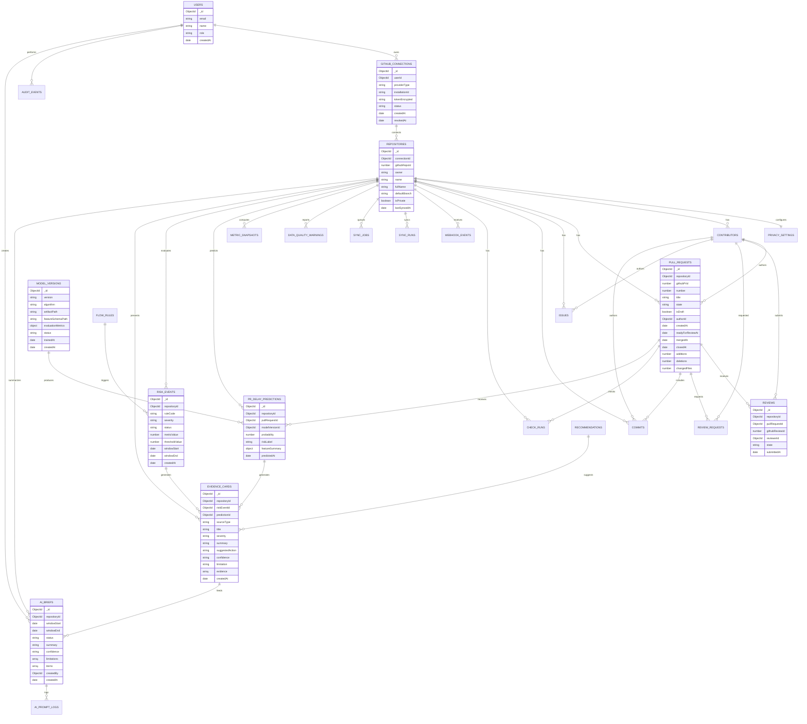
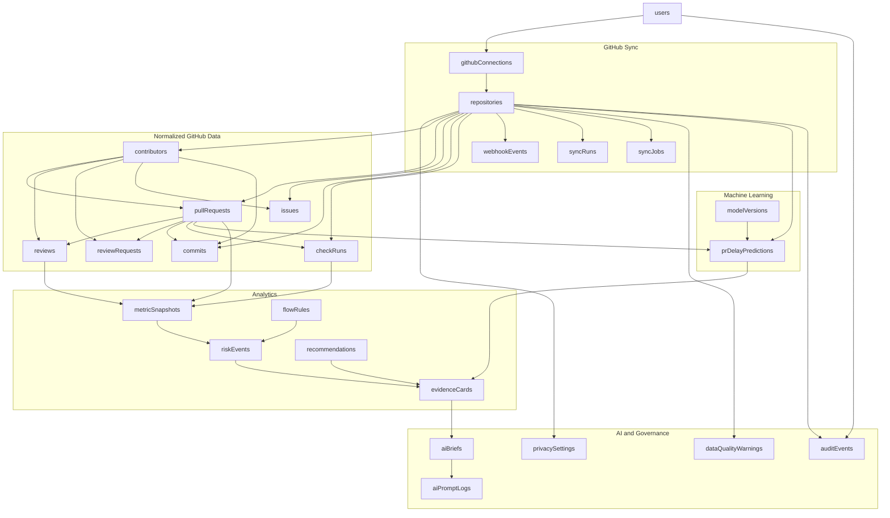

# MongoDB Database Design: AI Engineering Flow Intelligence for GitHub

## 1. Design Summary

The MongoDB design uses normalized collections for high-cardinality GitHub entities and embedded subdocuments for display-ready outputs such as Evidence Cards and AI Brief items.

Core principle:

```text
GitHub source data
-> normalized collections
-> metric snapshots
-> risk events
-> evidence cards
-> AI weekly briefs
```

For MVP, the database should support:

- One connected GitHub repository.
- Initial API backfill.
- Webhook or polling fallback.
- GitHub flow metrics.
- Rule-based Delivery Flow Risk.
- Evidence Cards.
- AI Weekly Brief.
- Privacy guardrails.

## 2. Mermaid ERD-Style Diagram



## 3. Collection Relationship Diagram



## 4. Collection Explanations

### 4.1 Identity and Connection

| Collection | Purpose | MVP? |
|---|---|---|
| `users` | Stores local application users who can connect repositories and generate AI briefs. | Must-have |
| `githubConnections` | Stores GitHub connection metadata, installation ID or encrypted token, status, and revocation state. | Must-have |
| `repositories` | Stores connected GitHub repository identity and sync status. Most other collections point to this. | Must-have |
| `privacySettings` | Stores per-repository privacy controls such as pseudonymization and minimum group size. | Must-have |

### 4.2 Normalized GitHub Data

| Collection | Purpose | MVP? |
|---|---|---|
| `contributors` | Stores normalized GitHub users as contributors, with masked identity fields for privacy-safe analytics. | Must-have |
| `pullRequests` | Stores PR metadata needed for PR cycle time, stale PR detection, oversized PR risk, and merge flow. | Must-have |
| `reviews` | Stores PR review metadata needed for review pickup time, review turnaround, and reviewer concentration. | Must-have |
| `reviewRequests` | Stores requested reviewer events when available; useful for review turnaround from request to submission. | Should-have |
| `issues` | Stores GitHub issue metadata for issue context. Useful, but PR analytics can work without it. | Should-have |
| `commits` | Stores commit metadata only. Used as context and to support activity recency, not productivity scoring. | Should-have |
| `checkRuns` | Stores GitHub Actions/check status for CI friction risk. | Should-have |

### 4.3 Sync and Event Processing

| Collection | Purpose | MVP? |
|---|---|---|
| `syncRuns` | Tracks initial backfill, polling, partial sync, and failures. Needed for sync status UI. | Must-have |
| `syncJobs` | Lightweight MongoDB-backed job queue for backfill, polling, recomputation, and brief generation. | Must-have if not using external queue |
| `webhookEvents` | Stores webhook delivery envelopes for dedupe, audit, and async processing. | Should-have |
| `dataQualityWarnings` | Stores missing permissions, incomplete sync, unavailable checks, invalid dates, and similar warnings. | Must-have |

### 4.4 Analytics

| Collection | Purpose | MVP? |
|---|---|---|
| `metricSnapshots` | Stores computed KPI values by repository and analysis window for repeatable dashboard and AI brief generation. | Must-have |
| `modelVersions` | Stores trained model identity, artifact paths, feature schema, evaluation metrics, and availability status. | Must-have |
| `prDelayPredictions` | Stores per-PR delay probability, Low/Medium/High label, model version, and feature summary. | Must-have |
| `flowRules` | Stores active Flow Risk Rulebook entries R1-R5 and thresholds. Could be seed config, but collection makes it explainable. | Must-have |
| `riskEvents` | Stores outputs from rule evaluation, including severity, rule code, metric value, and affected entities. | Must-have |
| `evidenceCards` | Stores display-ready evidence-backed insight cards linked to a `riskEventId` or `predictionId` for risk screen and AI brief. | Must-have |
| `recommendations` | Stores safe action catalog mapped to rule codes. Can start as seed data. | Must-have |

### 4.5 AI and Audit

| Collection | Purpose | MVP? |
|---|---|---|
| `aiBriefs` | Stores generated AI Weekly Briefs and embedded brief items. | Must-have |
| `aiPromptLogs` | Stores structured prompt payload and redaction state for demo transparency/debugging. | Should-have |
| `auditEvents` | Stores basic audit actions such as repository connected, sync completed, brief generated, privacy changed. | Should-have |

## 5. Recommended Indexes

### 5.1 Unique Indexes

```js
db.repositories.createIndex({ githubRepoId: 1 }, { unique: true });
db.pullRequests.createIndex({ repositoryId: 1, number: 1 }, { unique: true });
db.reviews.createIndex({ githubReviewId: 1 }, { unique: true, sparse: true });
db.commits.createIndex({ repositoryId: 1, githubSha: 1 }, { unique: true });
db.checkRuns.createIndex({ githubCheckId: 1 }, { unique: true, sparse: true });
db.webhookEvents.createIndex({ githubDeliveryId: 1 }, { unique: true, sparse: true });
db.metricSnapshots.createIndex(
  { repositoryId: 1, windowStart: 1, windowEnd: 1, metricKey: 1 },
  { unique: true }
);
db.modelVersions.createIndex({ version: 1 }, { unique: true });
db.prDelayPredictions.createIndex(
  { pullRequestId: 1, modelVersionId: 1 },
  { unique: true }
);
```

### 5.2 Query Indexes

```js
db.githubConnections.createIndex({ userId: 1, status: 1 });
db.repositories.createIndex({ connectionId: 1 });

db.contributors.createIndex({ repositoryId: 1, githubUserId: 1 });
db.pullRequests.createIndex({ repositoryId: 1, createdAt: -1 });
db.pullRequests.createIndex({ repositoryId: 1, state: 1 });
db.pullRequests.createIndex({ repositoryId: 1, mergedAt: -1 });
db.pullRequests.createIndex({ repositoryId: 1, authorId: 1 });

db.reviews.createIndex({ pullRequestId: 1, submittedAt: 1 });
db.reviews.createIndex({ repositoryId: 1, reviewerId: 1, submittedAt: -1 });
db.reviewRequests.createIndex({ pullRequestId: 1, requestedAt: 1 });

db.issues.createIndex({ repositoryId: 1, state: 1, createdAt: -1 });
db.commits.createIndex({ repositoryId: 1, committedAt: -1 });
db.checkRuns.createIndex({ repositoryId: 1, completedAt: -1 });
db.checkRuns.createIndex({ repositoryId: 1, conclusion: 1, completedAt: -1 });

db.syncRuns.createIndex({ repositoryId: 1, startedAt: -1 });
db.syncJobs.createIndex({ status: 1, runAfter: 1, lockedAt: 1 });
db.webhookEvents.createIndex({ repositoryId: 1, eventType: 1, receivedAt: -1 });
db.dataQualityWarnings.createIndex({ repositoryId: 1, severity: 1, createdAt: -1 });

db.metricSnapshots.createIndex({ repositoryId: 1, metricKey: 1, computedAt: -1 });
db.modelVersions.createIndex({ status: 1, trainedAt: -1 });
db.prDelayPredictions.createIndex({ repositoryId: 1, riskLabel: 1, predictedAt: -1 });
db.prDelayPredictions.createIndex({ pullRequestId: 1, predictedAt: -1 });
db.flowRules.createIndex({ ruleCode: 1 }, { unique: true });
db.riskEvents.createIndex({ repositoryId: 1, severity: 1, createdAt: -1 });
db.riskEvents.createIndex({ repositoryId: 1, ruleCode: 1, windowStart: 1, windowEnd: 1 });
db.evidenceCards.createIndex({ repositoryId: 1, severity: 1, createdAt: -1 });
db.recommendations.createIndex({ ruleCode: 1, actionCode: 1 });

db.aiBriefs.createIndex({ repositoryId: 1, createdAt: -1 });
db.aiPromptLogs.createIndex({ briefId: 1 });
db.auditEvents.createIndex({ repositoryId: 1, createdAt: -1 });
db.auditEvents.createIndex({ userId: 1, createdAt: -1 });
```

### 5.3 TTL Indexes Optional for Capstone

Use TTL only if the team wants automatic cleanup:

```js
db.webhookEvents.createIndex({ receivedAt: 1 }, { expireAfterSeconds: 60 * 60 * 24 * 30 });
db.aiPromptLogs.createIndex({ createdAt: 1 }, { expireAfterSeconds: 60 * 60 * 24 * 30 });
```

Do not use TTL on normalized GitHub entities, metrics, evidence cards, or briefs unless the product explicitly supports retention deletion.

## 6. MVP Must-Have vs Deferred Collections

### 6.1 MVP Must-Have

These are required for a strong GitHub-only capstone demo:

| Collection | Why it is required |
|---|---|
| `users` | Need local user identity for connect/generate actions. |
| `githubConnections` | Need GitHub repository connection metadata and token/installation state. |
| `repositories` | Central parent collection for all GitHub analytics. |
| `privacySettings` | Required to demonstrate privacy-safe analytics. |
| `contributors` | Needed for authors/reviewers and pseudonymization. |
| `pullRequests` | Core source for PR flow analytics. |
| `reviews` | Core source for review pickup/turnaround and reviewer load. |
| `syncRuns` | Required for sync status and partial/failure states. |
| `syncJobs` | Required if using MongoDB-backed async work instead of external queue. |
| `dataQualityWarnings` | Required to show limitations and missing data. |
| `metricSnapshots` | Required for stable dashboard and AI brief inputs. |
| `modelVersions` | Required to identify and validate the model used for each prediction. |
| `prDelayPredictions` | Required for UC-09 prediction persistence, Dashboard prediction cards, and prediction-based Evidence Cards. |
| `flowRules` | Required for explainable Flow Risk Rulebook. |
| `riskEvents` | Required to store rule outputs. |
| `evidenceCards` | Required for evidence-backed risk and AI insight display. |
| `recommendations` | Required for safe process recommendations. |
| `aiBriefs` | Required for AI Weekly Brief output. |

### 6.2 Should-Have for a Stronger Demo

These improve the demo but can be simplified if time is tight:

| Collection | Why it helps |
|---|---|
| `reviewRequests` | Makes review turnaround from request to review more accurate. |
| `issues` | Adds GitHub issue context and stale issue signals. |
| `commits` | Adds activity recency context; must not become productivity score. |
| `checkRuns` | Enables CI Friction Risk R4. |
| `webhookEvents` | Needed for real webhook dedupe/audit. Can be simulated if using polling only. |
| `aiPromptLogs` | Useful for capstone transparency and AI governance demo. |
| `auditEvents` | Useful for governance, but can be lightweight. |

### 6.3 Deferred / Later

These should not block MVP:

| Collection or capability | Reason to defer |
|---|---|
| Jira collections | Jira is Later scope. |
| Organization/multi-repo collections | MVP focuses on one repository. |
| Enterprise RBAC collections | Basic local user role is enough for capstone. |
| Billing/subscription collections | Not relevant to capstone MVP. |
| Full immutable audit ledger | Basic `auditEvents` is enough. |
| ML feature store | Training uses reproducible datasets and feature schema files; the MVP stores model versions and prediction outputs directly. |

## 7. Implementation Notes for Mongoose

### 7.1 Recommended Modeling Choices

- Use separate collections for `pullRequests`, `reviews`, `checkRuns`, `metricSnapshots`, and `prDelayPredictions`; they can grow large or require independent queries.
- Reference `prDelayPredictions.modelVersionId -> modelVersions._id` and `prDelayPredictions.pullRequestId -> pullRequests._id`; do not duplicate model evaluation data in every prediction.
- Enforce exactly one Evidence Card source: `riskEventId` for rule-based cards or `predictionId` for ML-based cards, identified by `sourceType`.
- Embed `evidence` inside `evidenceCards` because cards are display-ready and evidence rows are small.
- Embed `items` inside `aiBriefs` because a brief is read as one document.
- Keep `webhookEvents.payload` only as much as needed for debug/dedupe; consider storing hashed/minimized payload for privacy.
- Store `tokenEncrypted`, never raw GitHub tokens.

### 7.2 Naming Convention

- Mongoose model names: `User`, `GitHubConnection`, `Repository`, `PullRequest`, `Review`, etc.
- Collection names: camelCase plural, e.g. `githubConnections`, `pullRequests`, `metricSnapshots`.
- Use `repositoryId` as the main partition key in almost every operational collection.

### 7.3 Query Design Priority

The most important queries to optimize:

1. Dashboard metrics by `repositoryId` and time window.
2. Open/stale PRs by `repositoryId`, `state`, `createdAt`.
3. Reviews by `repositoryId`, `reviewerId`, `submittedAt`.
4. Check failures by `repositoryId`, `conclusion`, `completedAt`.
5. Risk events/evidence cards by `repositoryId`, `severity`, `createdAt`.
6. Latest AI brief by `repositoryId`, `createdAt`.
